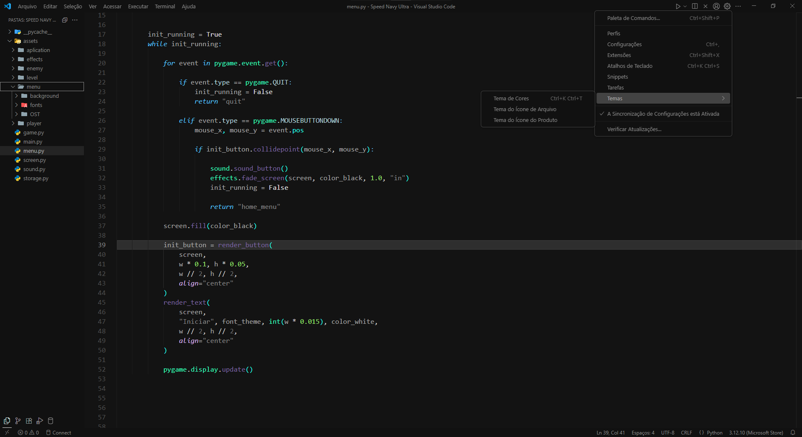

# Um Tema de Vanguarda para o Workflow

Apresento um tema meticulosamente projetado para o VS Code, onde o minimalismo se encontra com a profundidade, otimizando seu ambiente de desenvolvimento.

## Pré-visualização

## Instalação
[ maketplace ]
1 - Vá para a seção de Extensões (clique no ícone de "Extensions" na barra lateral ou use Ctrl + Shift + X).
2 - Pesquise por "Nome do Seu Tema".
3 - Clique em Instalar.
4 - Para ativar o tema, vá em File > Preferences > Color Theme (Arquivo > Preferências > Tema de Cores) e selecione "Nome do Seu Tema" na lista.

[ manual ]
1 - Baixe o arquivo .vsix do tema a partir da página de releases no GitHub.
2 - No VS Code, vá para a seção de Extensões.
3 - Clique nos três pontos (...) no canto superior direito do painel de Extensões.
4 - Selecione "Install from VSIX..." (Instalar a partir de VSIX...).
5 - Navegue até o arquivo .vsix que você baixou e selecione-o.
6 - Reinicie o VS Code, se necessário.
7 - Para ativar o tema, vá em File > Preferences > Color Theme e selecione "Nome do Seu Tema" na lista.

## Recursos
- Paleta de cores otimizada para o conforto visual.
- Foco em legibilidade e sintaxe de alta clareza.
- Compatibilidade total com a interface do VS Code.
- Suporte a diversas linguagens de programação.

## Design e Usabilidade
A estética deste tema não é uma mera escolha, mas um princípio. Inspirada na solidez de uma estrutura monolítica e na disciplina do mecanismo celestial, ela promove uma imersão total no código.

A paleta de cores é uma composição de tons escuros e suaves, pensada para reduzir a fadiga visual e minimizar o context switching mental. Sem cores agressivas, o tema cria um ambiente de trabalho sereno, essencial para longas sessões de codificação. Esse design minimalista é um aliado poderoso contra a poluição visual, ajudando você a manter o foco e aplicar os princípios do clean code com maior facilidade. É uma interface que desaparece, deixando você livre para interagir apenas com a lógica do seu código.

## Performance e Mente
Este tema não é apenas uma questão de aparência; é uma ferramenta para performance. Ele encapsula a disciplina e a velocidade necessárias para o desempenho máximo, semelhante à precisão de um piloto em um circuito. A intenção é transformar a tela em uma pista de corrida mental, onde cada linha de código é um avanço em direção à conclusão de um projeto.

## A Contemplação do Código
Em um universo de constantes mudanças, a ordem persiste na disciplina. Que o seu trabalho seja um reflexo do progresso, uma busca incessante por um futuro que nos pertence.

## Versão:
[ 1.0.1 beta ]

